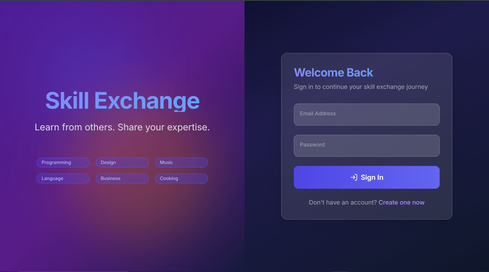
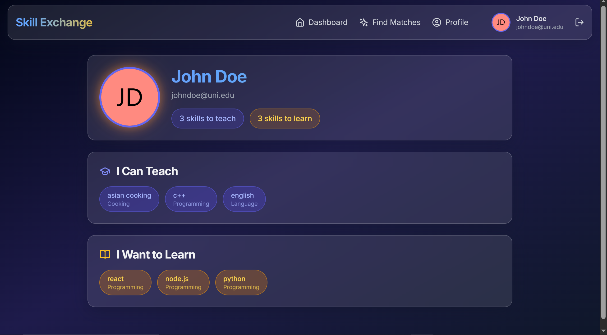
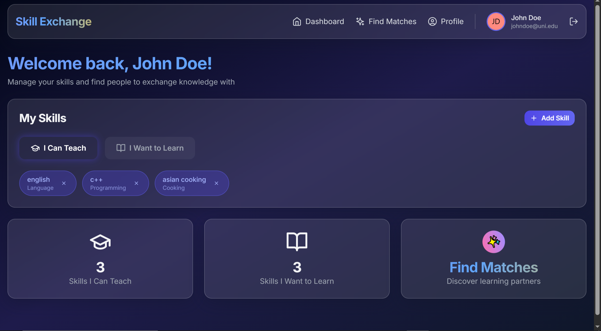
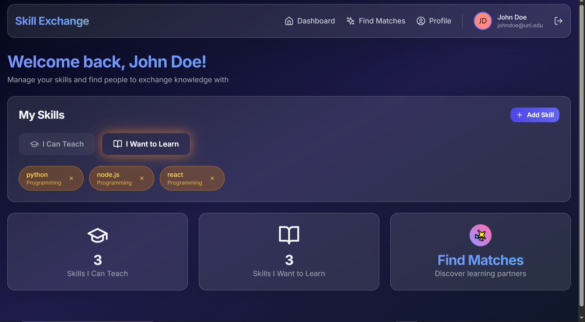
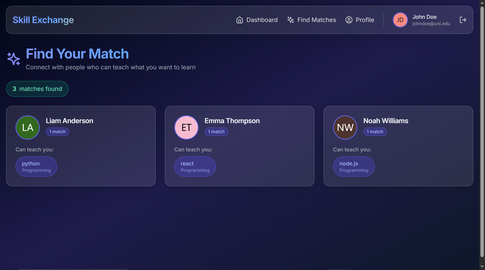
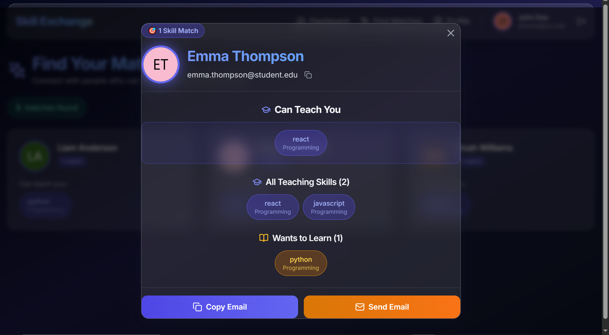

# Skill Exchange 2.0 - MERN Stack

A modern skill exchange platform built with MongoDB, Express, React, and Node.js featuring a stunning glassmorphism UI.

## Features

- 🎓 **Learn & Teach**: Share your expertise and learn from others
- 🤝 **Smart Matching**: Find the perfect learning partners
- ✨ **Beautiful UI**: Glassmorphism design with Framer Motion animations
- 🔐 **Secure Auth**: JWT-based authentication with HttpOnly cookies
- 📱 **Responsive**: Works seamlessly on all devices

## Tech Stack

### Backend
- Node.js & Express
- MongoDB & Mongoose
- JWT Authentication
- Joi Validation

### Frontend
- React 18 with TypeScript
- Vite
- Tailwind CSS
- Framer Motion
- React Router
- Axios

## Getting Started

### Prerequisites
- Node.js (v18 or higher)
- MongoDB (running locally or MongoDB Atlas)

### Installation

1. **Clone the repository**
   ```bash
   git clone <repo-url>
   cd skill-exchange-2.0
   ```

2. **Install server dependencies**
   ```bash
   cd server
   npm install
   ```

3. **Install client dependencies**
   ```bash
   cd ../client
   npm install
   ```

4. **Configure environment variables**
   
   Server (.env in /server):
   ```
   PORT=5000
   NODE_ENV=development
   MONGODB_URI=mongodb://localhost:27017/skill-exchange
   JWT_SECRET=your_super_secret_jwt_key
   JWT_EXPIRE=7d
   CLIENT_URL=http://localhost:3000
   ```
   
   Client (.env in /client):
   ```
   VITE_API_URL=http://localhost:5000/api
   ```

### Running the Application

1. **Start MongoDB**
   ```bash
   # If using local MongoDB
   mongod
   ```

2. **Start the backend server**
   ```bash
   cd server
   npm run dev
   ```
   Server will run on http://localhost:5000

3. **Start the frontend (in a new terminal)**
   ```bash
   cd client
   npm run dev
   ```
   Client will run on http://localhost:3000

## API Endpoints

### Authentication
- `POST /api/auth/register` - Create new account
- `POST /api/auth/login` - Login
- `GET /api/auth/me` - Get current user
- `POST /api/auth/logout` - Logout

### Skills
- `GET /api/skills` - Get all skills
- `POST /api/skills` - Create new skill
- `GET /api/skills/user/:userId` - Get user's skills
- `POST /api/skills/user` - Add skill to user
- `DELETE /api/skills/user/:userSkillId` - Remove skill from user
- `GET /api/skills/matches` - Find matching users

## Project Structure

```
skill-exchange-2.0/
├── client/                 # React frontend
│   ├── src/
│   │   ├── components/    # Reusable UI components
│   │   ├── context/       # React context providers
│   │   ├── hooks/         # Custom React hooks
│   │   ├── layouts/       # Page layouts
│   │   ├── pages/         # Page components
│   │   ├── utils/         # Utility functions
│   │   ├── App.tsx        # Main app component
│   │   └── main.tsx       # Entry point
│   └── package.json
└── server/                # Express backend
    ├── src/
    │   ├── controllers/   # Request handlers
    │   ├── middleware/    # Custom middleware
    │   ├── models/        # Mongoose models
    │   ├── routes/        # API routes
    │   ├── utils/         # Helper functions
    │   └── server.js      # Entry point
    └── package.json
```

## Design System

### Color Palette
- **Primary - Indigo**: Deep indigo shades from `#1e1b4b` to `#6366f1`
- **Secondary - Amber/Orange**: Warm accents from `#f59e0b` to `#f97316`
- **Background**: Slate dark tones (`#020617` to `#1e293b`)
- **Glass Effects**: Semi-transparent overlays with backdrop blur

### Gradients
- **Primary Gradient**: Indigo `#4f46e5` → `#6366f1`
- **Secondary Gradient**: Amber `#f59e0b` → Orange `#f97316`
- **Dark Gradient**: Slate `#020617` → `#1e293b`

### Animations
- Float, Glow, Gradient Shift, Tilt
- Fade In, Slide Up/Down, Scale In
- Page transitions with Framer Motion
- Hover effects and interactive micro-animations

## Screenshots

### Login and Authentication


### User Profile


### Dashboard



### Find Matches


### Skill Management


## Contributing

1. Fork the repository
2. Create your feature branch (`git checkout -b feature/AmazingFeature`)
3. Commit your changes (`git commit -m 'Add some AmazingFeature'`)
4. Push to the branch (`git push origin feature/AmazingFeature`)
5. Open a Pull Request

## License

MIT License - feel free to use this project for learning or production!

## Acknowledgments

- Design inspiration from react-bits and tailwindcss-ui-blocks
- Icons by Lucide React
- Fonts by Google Fonts (Inter)
