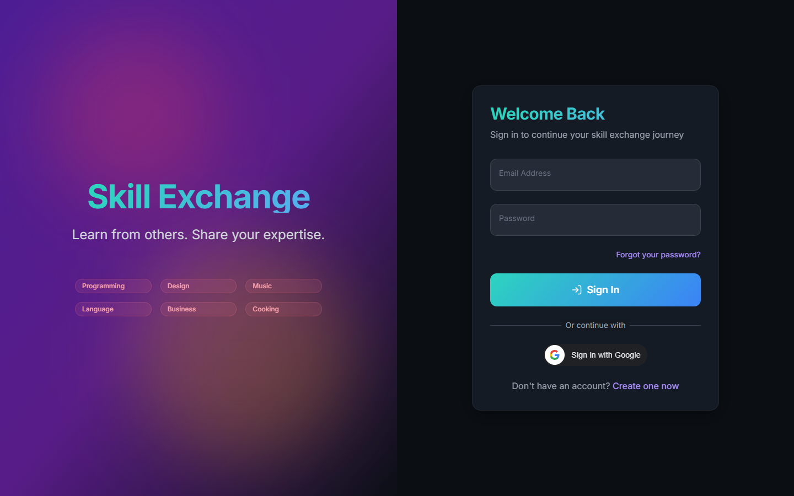
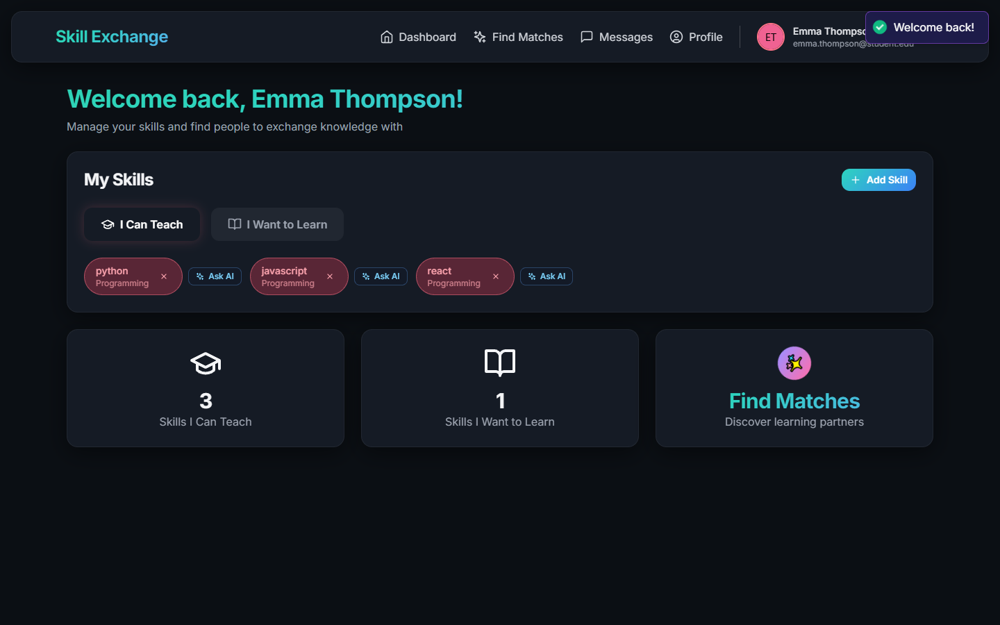
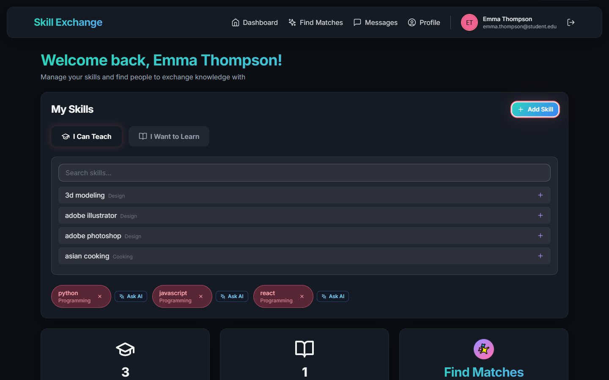
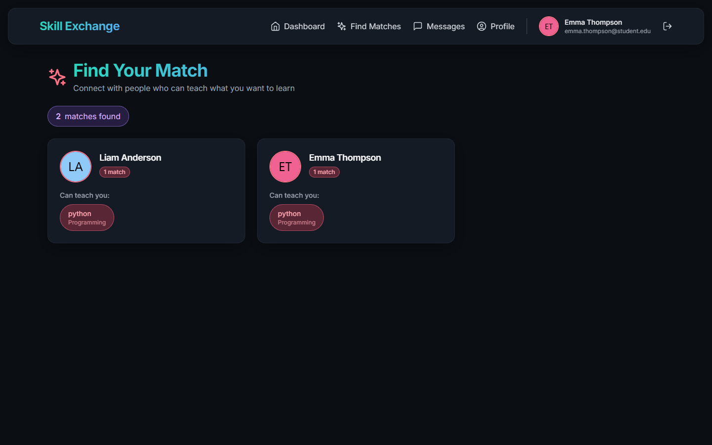
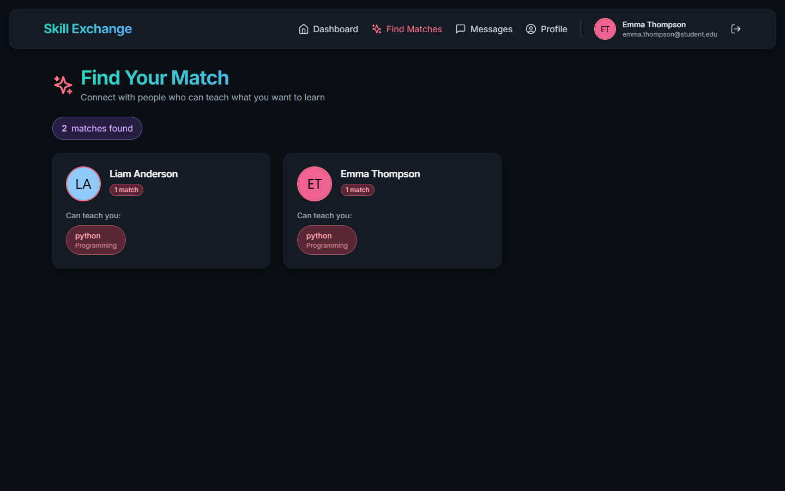
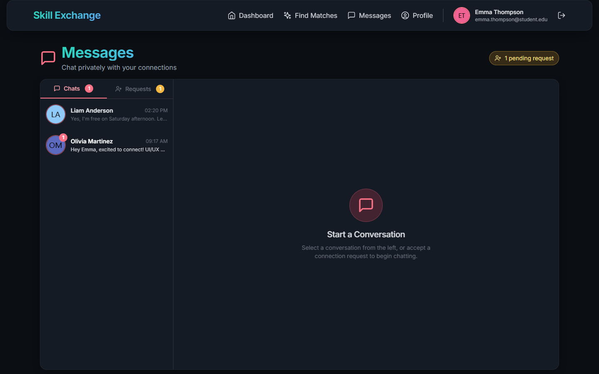
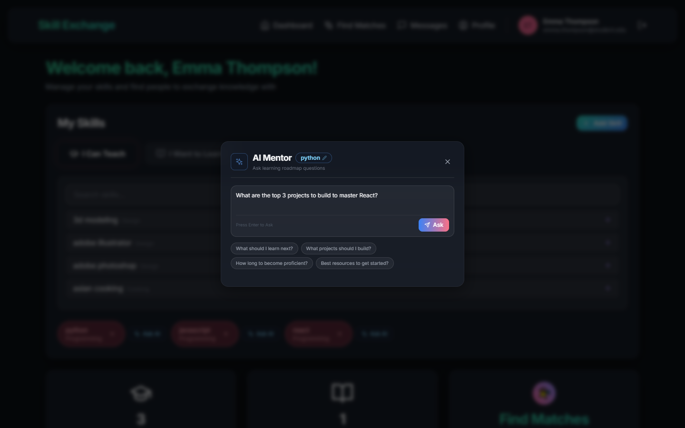
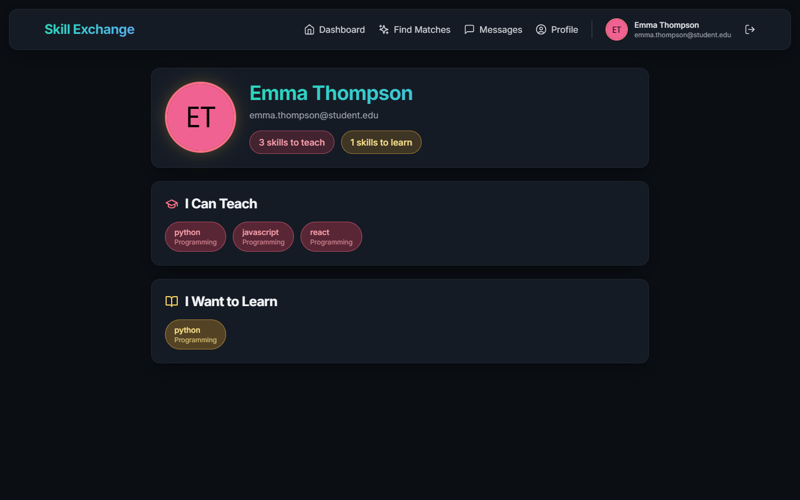

# Skill Exchange 2.0 - MERN Stack

Deployed here : https://skill-exchange-htcsaefxdfe8g2fv.southeastasia-01.azurewebsites.net

A modern skill exchange platform built with MongoDB, Express, React, and Node.js featuring a glassmorphism UI, real-time messaging, and an AI Skill Assistant.

## Features

- 🎓 **Learn & Teach**: Share your expertise and learn from others with customizable proficiency levels
- 🤝 **Smart Matching**: MongoDB aggregation pipeline matching users with complementary skills
- 💬 **Real-Time Direct Messaging**: Live socket-powered chat, connection request workflow, typing indicators, and unread badges
- 🤖 **AI Skill Assistant**: Powered by Google Gemini API to deliver custom learning roadmaps, resource recommendations, and interactive Q&A
- 🔑 **Flexible Authentication**: JWT auth with HttpOnly cookies, Google OAuth 2.0 integration, and secure password reset
- ✨ **Beautiful Glassmorphism UI**: Premium dark mode design with Framer Motion physics and interactive micro-animations
- 📱 **Fully Responsive**: Seamless performance across desktop, tablet, and mobile devices

## Tech Stack

### Backend
- Node.js & Express (ES Modules)
- MongoDB & Mongoose (Join model architecture with compound indexing)
- Socket.IO (Real-time bidirectional messaging)
- Google Generative AI (`@google/generative-ai` - Gemini API)
- JWT Authentication & Cookie Parser
- Joi Validation & bcryptjs
- Nodemailer / Resend

### Frontend
- React 18 with TypeScript
- Vite
- Socket.IO Client
- Google OAuth (`@react-oauth/google`)
- Tailwind CSS (Custom glassmorphism design system)
- Framer Motion
- React Markdown (AI response rendering with syntax highlighting)
- React Router v6 & Axios Interceptors

## Getting Started

### Prerequisites
- Node.js (v18 or higher)
- MongoDB (running locally or MongoDB Atlas)

### Installation

1. **Clone the repository**
   ```bash
   git clone https://github.com/praju120056/skill-exchange-2.0.git
   cd skill-exchange-2.0
   ```

2. **Install server dependencies**
   ```bash
   cd server
   npm install
   ```

3. **Install client dependencies**
   ```bash
   cd ../client
   npm install
   ```

4. **Configure environment variables**
   
   Server (`.env` in `/server`):
   ```env
   PORT=5000
   NODE_ENV=development
   MONGODB_URI=mongodb://localhost:27017/skill-exchange
   JWT_SECRET=your_super_secret_jwt_key
   JWT_EXPIRE=7d
   CLIENT_URL=http://localhost:3000
   GEMINI_API_KEY=your_gemini_api_key
   GOOGLE_CLIENT_ID=your_google_client_id
   ```
   
   Client (`.env` in `/client`):
   ```env
   VITE_API_URL=http://localhost:5000/api
   VITE_GOOGLE_CLIENT_ID=your_google_client_id
   ```

### Running the Application

1. **Start MongoDB**
   ```bash
   # If using local MongoDB
   mongod
   ```

2. **Seed Initial Skills & Sample Users (Optional)**
   ```bash
   cd server
   npm run seed
   npm run seedUsers
   ```

3. **Start the backend server**
   ```bash
   cd server
   npm run dev
   ```
   Server will run on http://localhost:5000

4. **Start the frontend (in a new terminal)**
   ```bash
   cd client
   npm run dev
   ```
   Client will run on http://localhost:3000

## API Endpoints

### Authentication
- `POST /api/auth/register` - Create new account
- `POST /api/auth/login` - Login with email & password
- `POST /api/auth/google` - Google OAuth authentication
- `POST /api/auth/forgot-password` - Request password reset token
- `POST /api/auth/reset-password` - Reset password with token
- `GET /api/auth/me` - Get current user profile
- `POST /api/auth/logout` - Logout (clears HttpOnly cookie)

### Skills
- `GET /api/skills` - Get all global skills
- `POST /api/skills` - Create new skill catalog entry
- `GET /api/skills/user/:userId` - Get user's skills
- `POST /api/skills/user` - Add skill to user profile
- `DELETE /api/skills/user/:userSkillId` - Remove skill from user
- `GET /api/skills/matches` - Find matching users via aggregation algorithm

### Connections & Direct Messaging
- `GET /api/connections` - Get user connections and pending requests
- `POST /api/connections/request` - Send connection request to a match
- `PUT /api/connections/:id` - Accept or decline connection request
- `GET /api/chat/conversations` - Fetch active conversations
- `GET /api/chat/messages/:conversationId` - Fetch chat message history

### AI Skill Assistant
- `POST /api/ai/mentor` - Get AI-generated skill learning roadmaps and answers (Google Gemini API)

## Project Structure

```
skill-exchange-2.0/
├── client/                 # React + TypeScript frontend
│   ├── src/
│   │   ├── components/    
│   │   │   ├── ai/        # AI Mentor modal & floating button
│   │   │   ├── chat/      # Conversation list, chat window, connection requests
│   │   │   ├── ui/        # AnimatedCard, Button, SkillBadge, etc.
│   │   ├── context/       # AuthContext provider
│   │   ├── hooks/         # Custom hooks (useSocket, useDebounce)
│   │   ├── layouts/       # AuthLayout & DashboardLayout
│   │   ├── pages/         # Dashboard, Matches, Messages, Profile, Login, Register, ForgotPassword
│   │   ├── services/      # aiService, chatService
│   │   └── utils/         # Axios instance & socket manager
│   └── package.json
└── server/                # Express backend & Socket.IO server
    ├── src/
    │   ├── controllers/   # Auth, Skill, Connection, Chat, AI controllers
    │   ├── middleware/    # Auth protector, rate limiter, error handler
    │   ├── models/        # User, Skill, UserSkill, Connection, Conversation, Message
    │   ├── routes/        # Auth, Skills, Connections, Chat, AI routes
    │   ├── services/      # geminiService (Google Generative AI)
    │   ├── socket/        # Real-time socket handler & events
    │   └── server.js      # Server entry point & static file server
    └── package.json
```

## Design System

### Color Palette
- **Primary - Indigo/Violet**: Deep indigo shades (`#1e1b4b` to `#6366f1`)
- **Secondary - Amber/Crimson**: Warm accents (`#f59e0b` to `#f97316`)
- **Background**: Slate dark tones (`#020617` to `#1e293b`)
- **Glass Effects**: Semi-transparent overlays with backdrop blur (`backdrop-blur-md border border-white/20`)

### Gradients & Animations
- **Gradients**: Indigo `#4f46e5` → Violet `#6366f1` / Amber `#f59e0b` → Crimson `#f97316`
- **Animations**: Framer Motion transitions, pulse glow, background blobs, micro-interactions

## Screenshots

### Login and Authentication


### Dashboard & Skill Management



### Smart Matching



### Real-Time Messaging & Connections


### AI Skill Assistant (Gemini API)


### User Profile


## Contributors
- [Prajakth](https://github.com/praju120056)
- [Praneeth](https://github.com/PraneethUpadhya195)

## License

MIT License - feel free to use this project for learning or production!

## Acknowledgments

- Google Gemini API for power-driven AI Mentorship
- Design inspiration from react-bits and tailwindcss-ui-blocks
- Icons by Lucide React
- Fonts by Google Fonts (Inter)
